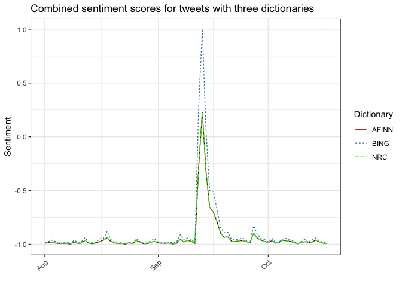

# Aim

Sentiment analysis is one of the initial step for text analysis, particularly if you are looking for the emotions. While it easier to do it English, it quite difficult to get the same results for other languages. Among others, the structure of the language is one of the biggest barriers. To facilitate this process, several dictionaries are developed by experts and adopted to other languages. 

As a social scientist, I try different types and versions of the dictionaries to get a better results. Nevertheless, every decision has same sort of trade offs because each dictionary comes with some strengths and weakness. 

There maybe better dictionaries available somewhere else I prefer more reliable sources since I need to cite them in academic papers. Since I have already write down these codes for myself to make sure which one better suits me, I want to share with you. If you have a better alternatives, please share with me. 

Here I will only illustrate how positive and negative sentiments vary across dictionaries using the same data. I like both tidytext and quanteda packages for text analysis, here I prefer quanteda package because it requires less coding. 


```r
# libraries 
# Three libraries are enough
library <- c("tidyverse", "lubridate","quanteda")
sapply(library, require, character.only = TRUE)
```

```
## tidyverse lubridate  quanteda 
##      TRUE      TRUE      TRUE
```


# Data

In this demonstration, I will use twitter data that downloaded for a research project. The data is about Finnish Green Party's proposal for cannabis legalization. The basic idea of the analysis here to look for how people react to proposal. However, dictionary preferences affect the results. To make sure to what extend the variation is, I apply each dictionary and compare their results. I will remove retweets since it is a sentiment analysis. The data includes tweets from August to the end of October 2021, which contains "cannabis" equivalent of Finnish words. The data reduced from 27212 to 17181 tweets after this process. 


```r
users <- readRDS("data/Cannabis/users.rds")


users <- users %>%
        mutate(tweet_type= case_when(
                sourcetweet_type == "quoted" ~ "quoted",
                sourcetweet_type == "retweeted" ~ "retweeted",
                TRUE ~ "original")) %>%
        filter(!tweet_type=="retweeted") 
```


# Dictionaries

## AFINN dictionary

The first one is the standard AFINN dictionary, developed by Finn Årup Nielsen. The AFINN lexicon is perhaps one of the simplest and most popular lexicons that can be used extensively for sentiment analysis. 

The current version of the lexicon is AFINN-fi-165.txt and it contains over 2575 Finnish words with a polarity score associated with each word. You can find this lexicon at the author’s official GitHub repository. 

The AFINN lexicon assigns words with a score that runs between -5 and 5, with negative scores indicating negative sentiment and positive scores indicating positive sentiment. When we check out the results, only 2 words are neutral and the rest are distributed across the scale. if we just divide then positive and negative, dictionar has 1632 negative and 941 positive words. It seems that it is more likely that dictionary catches more negative words. 

Since I will use the quenteda package, I converted each dictionary into quanteda dictionary format but I share samples below to show how it looks like. 


```r
afinn <- read.delim2("https://raw.githubusercontent.com/fnielsen/afinn/master/afinn/data/AFINN-fi-165.txt") 
colnames(afinn) <- c("word", "value")

head(afinn)
```

```
##           word value
## 1      hylätty    -2
## 2     hylätään    -2
## 3     kaapattu    -2
## 4 sieppaaminen    -2
## 5  sieppaukset    -2
## 6    kauhistus    -3
```

```r
# distibution
table(afinn$value)
```

```
## 
##   -5   -4   -3   -2   -1    0    1    2    3    4    5 
##   23   43  272 1024  270    2  207  491  180   58    5
```

```r
afinn_dict <- dictionary(list(positive = afinn$word[afinn$value>0], negative = afinn$word[afinn$value<0]))

afinn_dict
```

```
## Dictionary object with 2 key entries.
## - [positive]:
##   - kyvyt, kyky, kyytiin, vapauttaa, absolved, absolves, absolving, absorboitunut, hyväksyä, hyväksyttävä, hyväksyminen, hyväksytty, hyväksyy, saatavilla, suosiota, arvostettu, tunnustukset, saavuttaa, saavutettu, suorittaa [ ... and 921 more ]
## - [negative]:
##   - hylätty, hylätään, kaapattu, sieppaaminen, sieppaukset, kauhistus, ahdistunut, kauhistuttava, abhors, aborted, keskeyttää, poissaolevalla, poissa olevat, väärinkäyttö, väärin, väärinkäytökset, väärinkäytöllä, onnettomuus, vahingossa, onnettomuudet [ ... and 1,612 more ]
```


## Bing dictionary 

The Bing lexicon categorizes words in a binary fashion into positive and negative categories. 

I download this version from [Meta Share](http://www.meta-share.eu/) website. There are 1332 positive and 1961 negative words, a total combination of 3293 words. I came across the same dictionaries in several webpages but the content is always the same. Although the Bing dictionary has more negative words, the gap between two distribution is smaller compared to other dictionaries. This one also more likely to catch negative words. 


```r
positive <- read.delim2("languages/opinion-lexicon/positive_words_fi.txt") 

head(positive)
```

```
##     kuin
## 1 voitti
## 2  toimi
## 3  kuten
## 4    yli
## 5  hyvin
## 6   asti
```

```r
negative <- read.delim2("languages/opinion-lexicon/negative_words_fi.txt") 
head(negative)
```

```
##          noin
## 1        vain
## 2        yksi
## 3         eri
## 4        olla
## 5 erityisesti
## 6        pois
```

```r
bing <- read.csv("languages/bing/fi.csv")
head(bing)
```

```
##     word sentiment
## 1 voitti  positive
## 2  toimi  positive
## 3  kuten  positive
## 4    yli  positive
## 5  hyvin  positive
## 6   asti  positive
```

```r
#dict
bing_dict <- readRDS("languages/bing/bing_dict.rds") 
bing_dict 
```

```
## Dictionary object with 2 key entries.
## - [positive]:
##   - kuin, voitti, toimi, kuten, yli, hyvin, asti, toimii, suurin, käyttää, avulla, aikaan, vasta, pitää, suuri, uudelleen, uusi, piti, lähellä, oleva [ ... and 1,313 more ]
## - [negative]:
##   - noin, vain, yksi, eri, olla, erityisesti, pois, alue, juuri, huolimatta, läpi, ainoa, liian, vähän, maa, ympäri, eniten, löytää, maata, yleinen [ ... and 1,942 more ]
```


## NRC 

The NRC lexicon categorizes words in a binary fashion (“yes”/“no”) into categories of positive, negative, anger, anticipation, disgust, fear, joy, sadness, surprise, and trust. 

For the NRC dictionary, I used Helsinki University repository, named as [SELF and FEIL: Emotion Lexicons for Finnish](https://github.com/Helsinki-NLP/SELF-FEIL)

These are the SELF (Sentiment and Emotion Lexicon for Finnish) and FEIL (Finnish Emotion Intensity Lexicon) lexicons for Finnish. They are based on the [NRC Emotion Lexicons](http://saifmohammad.com/WebPages/lexicons.html) and are revised extensions of the automatic translations done by the original creator.

There are 43410 words in the FEIL dictionary but it does not include positive and negative sentiment. However, the SELF dictionary includes 5835 words, which 2117 of them positive and 2938 of them are negative.  The NRC has the most coverage with more than 5000 words. 


```r
nrc <- read_delim("https://raw.githubusercontent.com/Helsinki-NLP/SELF-FEIL/main/SELF.tsv")


head(nrc)
```

```
## # A tibble: 6 × 12
##   word          positive negative anger anticipation disgust  fear   joy sadness
##   <chr>            <dbl>    <dbl> <dbl>        <dbl>   <dbl> <dbl> <dbl>   <dbl>
## 1 aallonpohja          0        1     0            0       0     0     0       0
## 2 aamen                1        0     0            0       0     0     1       0
## 3 aamiainen            1        0     0            0       0     0     0       0
## 4 aamuvastaano…        0        0     0            0       0     0     0       0
## 5 aarre                1        0     0            1       0     0     1       0
## 6 aasi                 0        1     0            0       1     0     0       0
## # … with 3 more variables: surprise <dbl>, trust <dbl>, Sum of labels <dbl>
```

```r
table(nrc$positive);table(nrc$negative)
```

```
## 
##    0    1 
## 3717 2117
```

```
## 
##    0    1 
## 2896 2938
```

```r
# its combination
bing_feil <- read.csv("languages/bing/bing_feil.csv")
head(bing_feil)
```

```
##   X           word sentiment
## 1 1    aallonpohja  negative
## 2 2           aasi  negative
## 3 3     aavemainen  negative
## 4 4        abortti  negative
## 5 5 aggressiivinen  negative
## 6 6      aggressio  negative
```

```r
# dictionary format
 feil_dict <- readRDS("languages/bing/feil_dict.rds")
 feil_dict 
```

```
## Dictionary object with 2 key entries.
## - [positive]:
##   - aamen, aamiainen, aarre, aatelismies, aatelisto, aavistaa, abba, absoluuttinen, accueil, aga, ahdistunut, ahkeruus, aiempi, aiheellinen, aine, aineelliset, ainutlaatuinen, aistikas, aistillinen, aistillisuus [ ... and 2,096 more ]
## - [negative]:
##   - aallonpohja, aasi, aavemainen, abortti, aggressiivinen, aggressio, ahdas, ahdinko, ahdistaa, ahdistava, ahdistelu, ahdisti, ahdistuneisuus, ahdistus, ahnas, ahne, ahneus, ahtaa, aiheuttaa, ailahtelevainen [ ... and 2,908 more ]
```

# Sentiment analysis

Let's try dictionaries now. Here first I identified number of positive and negative sentiments for each tweets and then subsract negative score from positive one. The result show the final score for the tweet. 

### Bing dictionary

The total sentiment score is 0.3014376, a little bit above the 0.


```r
# tokenize
twusers <- corpus(users, text_field = "text")

# apply dictionary
sent_bing <- dfm(twusers, dictionary = bing_dict)
head(sent_bing)
```

```
## Document-feature matrix of: 6 documents, 2 features (25.00% sparse) and 31 docvars.
##        features
## docs    positive negative
##   text1        1        1
##   text2        1        0
##   text3        4        1
##   text4        0        1
##   text5        1        2
##   text6        0        1
```

```r
# We can then extract the score and add it to the data frame as a new variable
twusers$score_bing <- as.numeric(sent_bing[,1]) - as.numeric(sent_bing[,2])

#what is the average sentiment score?
  mean(twusers$score_bing)
```

```
## [1] 0.3014376
```
 
 In this step, I bring the most positive and negative tweets. Finally, I calculate overall scores for the whole tweets. Since I have already calculated the positive and negative scores for each tweets, I rate tweets as neutral, positive and negative. 
 

```r
############# what is the most positive and most negative tweet?
# most positive
  users[which.max(twusers$score_bing),]$text
```

```
## [1] "@Petri2020 @ptkarvinen Voidaan ennustaa aika hyvin. Rikollisilla on valmis jakeluverkosto ja vakiintunut hinta.\n\nJos laillinen kannabis on paljon kalliimpaa ja hankalammin saatavilla, pysyy osa markkinoista rikollisilla.\n\nSama voi käydä alkoholin kanssa, tai tupakan kanssa.\n\nMarkkinat hoitaa."
```

```r
# most negative
  users[which.min(twusers$score_bing),]$text
```

```
## [1] "- Kansalla #uhkapeli'ongelmia =&gt; perustetaan valtion monopoli, että saadaan vähennettyä haittoja\n\n- Kansalla #alkoholi'ongelmia =&gt; perustetaan valtion monopoli, että saadaan vähennettyä haittoja\n\n- Kansalla #kannabis\"ongelmia\" =&gt; kieltolaki on ainoa keino vähentää haittoja https://t.co/agK0XpUZ0N"
```

```r
  # what is the proportion of positive, neutral, and negative tweets?
  twusers$sentiment_bing <- "neutral"
  twusers$sentiment_bing[twusers$score_bing<0] <- "negative"
  twusers$sentiment_bing[twusers$score_bing>0] <- "positive"
  table(twusers$sentiment_bing)
```

```
## 
## negative  neutral positive 
##     4243     6103     6835
```

This dictionary categorize 4243 tweets as negative, 6835 tweets as positive and 6103 tweets as neutral. Overall, according to Bing results, people have more positive emotions toward the cannabis proposal. 


### AFINN dictionary

Let's try AFINN dictionary. Same principles are also applied here however, AFINN dictionary calculates overall score as negative,  the same score but with a different sign.


```r
# apply dictionary
sent_afinn <- dfm(twusers, dictionary = afinn_dict)

# We can then extract the score and add it to the data frame as a new variable
twusers$score_afinn <- as.numeric(sent_afinn[,1]) - as.numeric(sent_afinn[,2])

#what is the average sentiment score?
  mean(twusers$score_afinn)
```

```
## [1] -0.3031255
```


```r
############# what is the most positive and most negative tweet?
# most positive
  users[which.max(twusers$score_afinn), ]$text
```

```
## [1] "@CoelThomas @knkinnunen Hyvä Coel! Kun vaan Jarikin tietäisi, että ihan hänen entisissä alaisissaankin ja kollegoisaa ympäri suomea on kannabiksen jopa säännöllisiä käyttäjiä ja hyvin suuri osa nuoremmista poliiseista laillistamista kannattaa. Kyllä se totuus vielä joskus onneksi selviää.."
```

```r
# most negative
  users[which.min(twusers$score_afinn),]$text
```

```
## [1] "HS KYSYI eduskuntaryhmiltä (puheenjohtajilta), kannattaisivatko ne kannabiksen laillistamista:\n\nVihreät: kyllä\nKokoomus: ei\nSdp: ei\nKeskusta: ei\nKd: ei\nPS: ei\nVas: ei\nRkp: ei\n\nKuka ei kuulu joukkoon??\n\n#Kannabis\n\nLähde: HS"
```

```r
  # what is the proportion of positive, neutral, and negative tweets?
  twusers$sentiment_afinn <- "neutral"
  twusers$sentiment_afinn[twusers$score_afinn<0] <- "negative"
  twusers$sentiment_afinn[twusers$score_afinn>0] <- "positive"
  table(twusers$sentiment_afinn)
```

```
## 
## negative  neutral positive 
##     6255     7631     3295
```

AFINN dictionary categorized 6255 tweets as negative and 3295 tweets as positive while 7631 tweets were rated as neutral. The number of negative tweets is approximately twice size of the positive tweets. Compared to Bing dictionary, we have now very different results. 


### NRC dictionary

Since the NRC dictionary has more coverage, I kept it for the final. After following the same process, NRC rated overall tweets as negative, with the score of -0.2752459, which is very similar to AFINN score. 


```r
# apply dictionary
sent_nrc <- dfm(twusers, dictionary =  feil_dict)

# We can then extract the score and add it to the data frame as a new variable
twusers$score_nrc <- as.numeric(sent_nrc[,1]) - as.numeric(sent_nrc[,2])

#what is the average sentiment score?
 mean(twusers$score_nrc)
```

```
## [1] -0.2752459
```


```r
############# what is the most positive and most negative tweet?
# most positive
  users[which.max(twusers$score_nrc),]$text
```

```
## [1] "@80Hyttinen @YleTV1 Arkista elämänmenoa kun seuraa niin kyllä vain miedot huumeet ovat sisäänheittotuote. Lähiöissä nuoret aika nopeasti siirtyvät vahvempiin, kun niitä on helposti saatavilla. \n\nKevyt kannabiksesta nautiskelu on lähinnä ylemmän keskiluokan harrastus. Heidän vuokseen lailliseksi?"
```

```r
# most negative
  users[which.min(twusers$score_nrc),]$text
```

```
## [1] "@SannaHellstrom RAJOJA\n\n-Tupakka on nautintoaine. Myynnin ikäraja on 18 v.\n-Nuuskan myynti on kielletty.\n-Alkoholin eli yli 1.2 %, myynti, hallussapito ja käyttö alle 18 v. on kielletty. Yli 80 % myynti on kielletty kaikilta.\n-Kannabiksen myynti ja hallussapito on kielletty."
```

```r
  # what is the proportion of positive, neutral, and negative tweets?
  twusers$sentiment_nrc <- "neutral"
  twusers$sentiment_nrc[twusers$score_nrc<0] <- "negative"
  twusers$sentiment_nrc[twusers$score_nrc>0] <- "positive"
  table(twusers$sentiment_nrc)
```

```
## 
## negative  neutral positive 
##     6409     6784     3988
```
The NRC dictionary categorized 6409 tweets as negative and 3988 tweets as positive while found 6784 tweets as neutral. The gap between positive and negative tweets are smaller compared to AFINN dictionary results.


# Weighted scores of the tweets

Finally, I also calculate the dfm weights and plot the results in timeline to show how weighted results vary across dictionaries. 

It shows that AFINN and NRC is totally identical although the coverage of the dictionaries is very different. Until I use dash line, I tried to find an error in the plot graph because those two dictionary is almost merged through timeline and I could not diffentiate it. 


```r
dfm.user <- dfm(twusers, groups = c(date(ymd_hms(twusers$created_at))), dictionary = bing_dict)

# bing
dfm.user.bing <- dfm_weight(dfm(twusers, groups = c(date(ymd_hms(twusers$created_at))), dictionary = bing_dict))
# afinn
dfm.user.afinn <- dfm_weight(dfm(twusers, groups = c(date(ymd_hms(twusers$created_at))), dictionary = afinn_dict))
# nrc
dfm.user.nrc <- dfm_weight(dfm(twusers, groups = c(date(ymd_hms(twusers$created_at))), dictionary = feil_dict))


sentiment.user.nrc <- convert(dfm.user.nrc, "data.frame") %>% mutate(Dictionary = "NRC")
sentiment.user.afinn <- convert(dfm.user.nrc, "data.frame") %>% mutate(Dictionary = "AFINN")
sentiment.user.bing <- convert(dfm.user.bing, "data.frame") %>% mutate(Dictionary = "BING")


sentiment.combined <- bind_rows( sentiment.user.nrc, sentiment.user.bing, sentiment.user.afinn ) %>% 
        gather(positive, negative, key = "Polarity", value = "Sentiment") %>% 
        filter(Polarity == "positive") %>% 
        mutate(Date= date(ymd(doc_id))) %>%
        mutate(Sentiment = scales::rescale(Sentiment, to = c(-1,1))) %>% 
        select(Date, Dictionary, Sentiment)
# Visualization
ggplot(sentiment.combined, aes(x = Date, y = Sentiment)) + 
        geom_line(aes(color = Dictionary, linetype = Dictionary)) + 
        scale_color_manual(values = c("darkred", "steelblue", "green"))+
        theme_bw()+
        ggtitle("Combined sentiment scores for tweets with three dictionaries") + 
        xlab("") + theme(axis.text.x = element_text(angle = 45, hjust = 1))
```

<!-- -->

# Conclusion

1. This turns out to be a method post but I believe it helps many other to conduct their sentiment analysis with this step by step process. I would like to hear others' approach to improve the results. Even other dictionary dictionary suggestions worth to text here.  

2. Although AFINN and NRC have different approached and coverage, they tend to produce similar results. Bing dictionary produces very different outcomes compared to others. It might be not only related to coverage of the dictionaries but also the topic such as cannabis discussion here or context, such as tweets produce different results. Before coming up with a quick conclusion, it is important to test the dictionaries with other contexts. 
  
3. For the cannabis discussion, we will have a separate paper for it but results definitely show a positive reaction to the proposal. Since here data includes a longer period, the calculation includes tweets before and after the proposal discussions. The peak area shows the proposal time, where many people involved into discussion and the sentiment direction went upward although the total attitude is barely pass the 0 line. 


